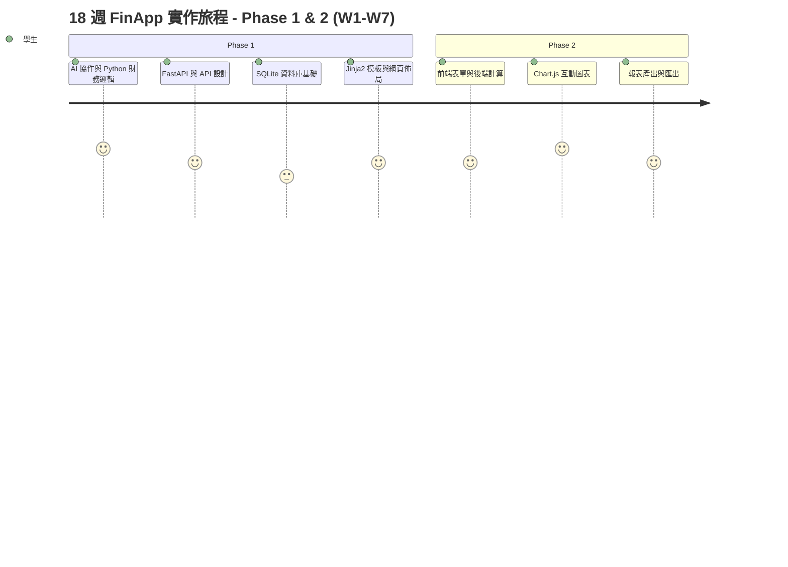
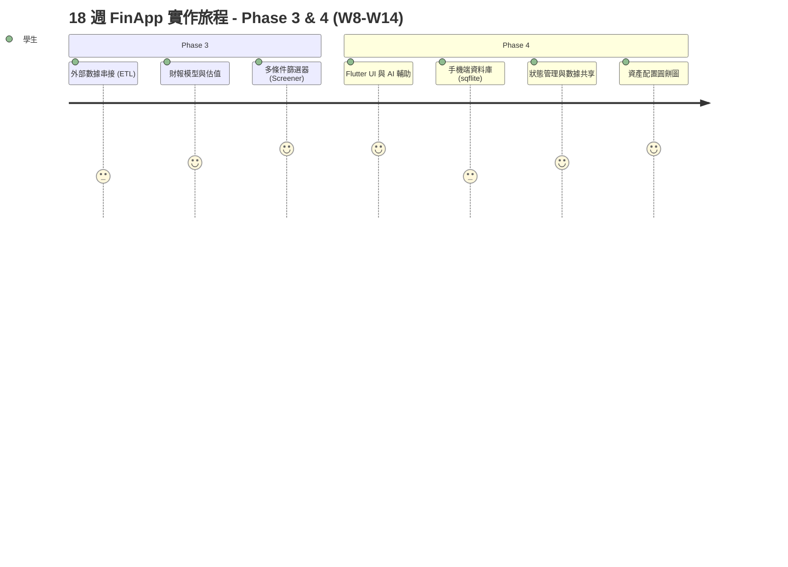
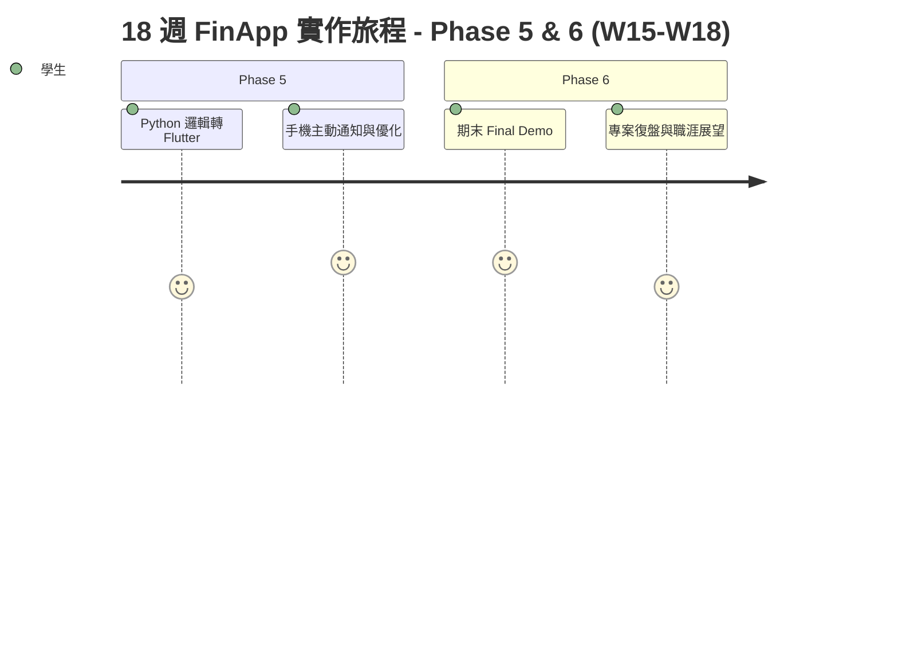
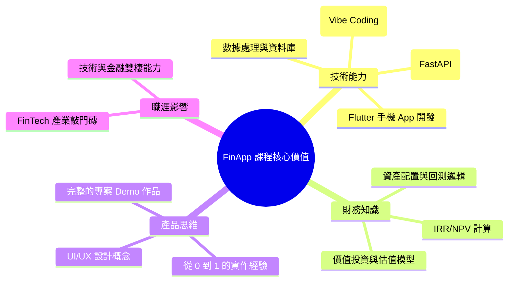

# FinApp 18 週實作課程：從零到一的財經 App 探索之旅

## 課程簡介 (15分鐘)

歡迎加入 **FinApp 18 週實作課程**！這是一趟結合**程式設計**與**財務金融**的奇妙旅程。在接下來的 18 週裡，我們不是在學枯燥的理論，而是要動手打造出屬於你自己的財經應用程式。

我們將採用最前沿的 **Vibe Coding** 理念——這意味著你不需要把每一行程式碼都死記硬背。我們會教你如何與 AI 協作，讓 AI 成為你的超級助理，幫你處理繁瑣的程式碼，而你只需要專注於**邏輯分析**與**產品設計**。

---

## 課程學習地圖

讓我們來看看這 18 週的精彩旅程我們將會經歷哪些階段：

---

## 我們將會打造的四個 App

這 18 週，你將會親手完成 **四個** 具有真實應用價值的 App：

1. **[Web] 「富足人生」財務規劃模擬器**：計算複利效應，視覺化你的資產成長。
2. **[Web] 「護城河」價值投資分析儀**：抓取真實股票數據，找出被低估的好公司。
3. **[Mobile] 「隨身帳房」多資產記帳本**：在手機上記錄生活開支與投資狀況。
4. **[Mobile] 「訊號塔」量化策略監控站**：串接即時 API，觸發進出場的手機推播通知。

---

## 為什麼要學這門課？ (你能帶走什麼)

## 結語

準備好迎接挑戰了嗎？讓我們開始這趟不可思議的 FinApp 旅程吧！
