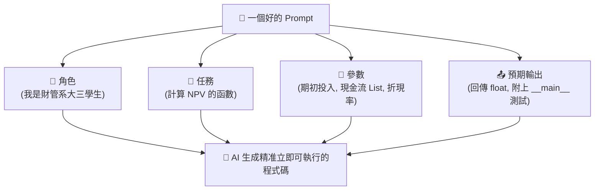
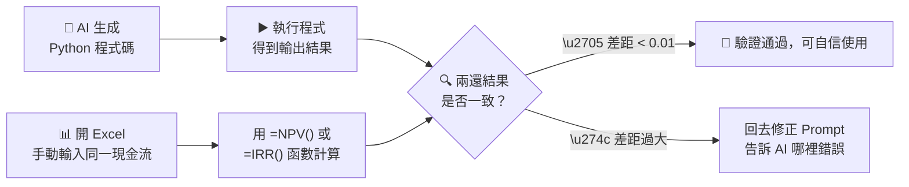

# Week 1: AI 協作指南

## 跟 AI 溝通的重點

對我們初學者來說，最大的挑戰大概就是「不知道怎麼跟 AI 下指令」。所以在這單元裡，我們要來調整一下寫指令 (Prompt) 的邏輯，讓 AI 聽得懂我們想要什麼。

## 我們的學習步驟

### Step 1: 看看無效的指令會怎樣

* **不佳的示範**: "幫我寫一個投資的程式。"
* **結果**: AI 會瞎猜我們的意圖，結果就是丟出一大堆超複雜、但我們現在根本不需要的程式碼（比如說自己跑去抓股票 API 的自動機器人...完全看不懂啊囧）。

### Step 2: 怎麼寫出精確的指令

我們可以試著套用這個「角色 + 任務 + 參數 + 預期輸出」的公式：

* **明確的 Prompt 範例**: "我是一個財管系大三學生。請幫我用 Python 寫一個計算 NPV (淨現值) 的函數。你設計的輸入參數需要包含：期初投資金額、未來每一期現金流的 List，還有折現率 (float)。這個函數最後只要回傳算好的 NPV 數字 (浮點數) 就好，然後請在程式碼最後加上一個簡單的 `__main__` 測試讓我看看結果。"

### Step 3: 驗證 AI 的產出 (很重要！)

不要太相信 AI，它偶爾也會「一本正經地胡說八道」(幻覺 Hallucination)！特別是在寫我們財管的數學公式時，很常會忘記一些細節（比如說現金流是從第 0 期還是第 1 期開始折現）。

* **我們的實作要求**: 自己開個 Excel，用裡面內建的 `=NPV()` 或是 `=IRR()` 函數，輸入同一組現金流測試看看。
* **比對任務**: 執行 AI 寫好的 Python 腳本，看看畫面上印出的結果，有沒有跟我們在 Excel 上算出來的一樣（至少要精準到小數點後兩位）。自己驗算過才能放心，這是我們財管人對數字的堅持！

