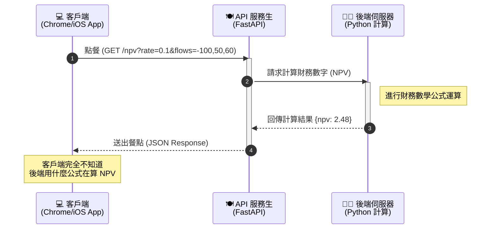

# 主題一：API (Application Programming Interface)

## 什麼是 API？

API 的全名是 Application Programming Interface (應用程式介面)。對我們商科生來說，可以把它想像成餐廳裡的「服務生」。如果您是顧客 (Client，像是網頁或手機 App)，而廚房是伺服器 (Server，負責跑 Python 的地方)，您根本不需要知道廚房裡的廚師是用什麼姿勢切菜、怎麼算出 NPV 的。您只需要透過服務生 (API) 點餐，服務生就會把算好數字的餐點 (Response) 送到您面前。

## 為什麼做財務系統需要 API？

在現代的軟體架構裡，「前端」跟「後端」分工合作 (分開來寫) 早就已經是標準配備了。

1. **解耦 (Decoupling：各自安好)**：前端網頁或手機 App 不用塞滿複雜的財務計算公式，只要把參數丟給後端算就好，這樣畫面跑起來更順，程式也比較好維護。
2. **跨平台 (一魚多吃)**：我們只要寫好一個算 NPV 的 API (例如 `/calculate/npv`)，就可以同時提供給我們的網站 (Web)、iPhone (iOS App) 還有安卓 App 來取用，一次開發，到處享受。
3. **保護機密 (防毒防駭防小偷)**：例如一些幫客戶操盤的量化策略演算法，我們可以把它好好藏在伺服器端，外面的人只能透過 API 丟數字進來拿結果，完全看不到我們核心的商業機密。

