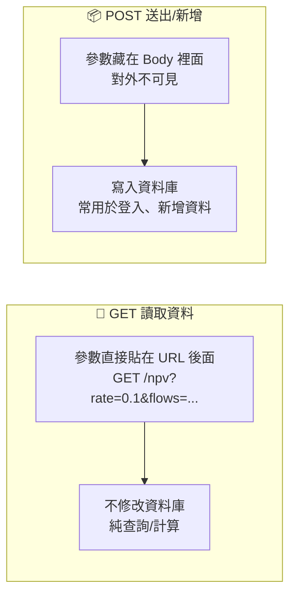
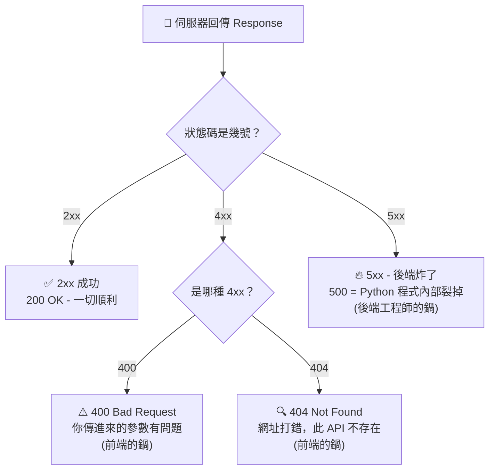

# 主題二：HTTP 協定基礎

## Request (請求) 與 Response (回應)

當兩台電腦或是手機要透過 API 溝通交談的時候，它們就需要講同一種語言，也就是 **HTTP (HyperText Transfer Protocol)**。

* **Request (請求對話)**：想像當我們在瀏覽器上面輸入網址按 Enter 的那個瞬間，其實就是對遠方的伺服器發射出一個 Request。這個封包裡面通常帶著什麼呢？
  * **Method** (我們的意圖，比如是來「讀資料」還是「新增資料」的)
  * **URL** (我們要去敲的門牌號碼 / 目標位址)
  * **Headers** (一些履歷表或是信封上的標頭資訊，像我們是用 Chrome 還是 Safari、有沒有帶登入的 Token)
  * **Body** (包裹裡真正的貨物！例如我們填寫開戶資料時送出的帳號密碼，或是很長一串的股票代碼清單)

## 常見的 HTTP 方法

我們這週先把心力放在 **GET** 這一招，把它用熟：

1. **GET (讀取)**：純粹向伺服器要資料，不會動到資料庫裡的數字。參數通常直接大剌剌地寫在網址後面 (例如查股價 `?ticker=TSLA`)。這週的 NPV API 簡介就是用這招 ——請將參數寫在網址上，直接在瀏覽器按 Enter 就能測試！
2. **POST (新增/送出)**：用來傳遞機密資料或是要把一筆交易紀錄寫進去的時候。參數會包裝起來藏在封包肚子 (Body) 裡面。→ **Week 5 表單實作時會完整介紹，這週先記住就好。**

## 狀態碼 (Status Codes)

伺服器算好回覆給我們時，除了給資料，還會順便給一張「健康檢查報告」的狀態碼：

* **200 OK**：平安無事，交易成功！
* **400 Bad Request**：前端的鍋！意思是我們客戶端做錯事啦，比如人家要金額數字我們卻給了英文字母 `A`。
* **404 Not Found**：就是大家最常看到的「找不到網頁」。這個 API 路由可能根本沒被註冊。
* **500 Internal Server Error**：後端的鍋！代表伺服器內部大爆炸當機了，通常是我們寫的 Python 程式裡某一行報錯 (Exception)，我們又沒有寫 `try...except` 把錯誤給接住。

