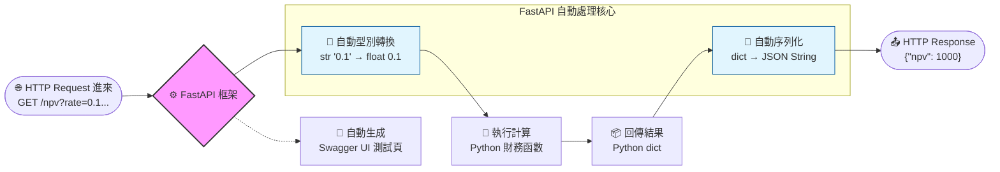

# 主題三：為什麼要用 FastAPI 來實作？

## Web 框架的概念

要把我們寫的 Python 程式變成網路上可以點選連結的服務，如果叫我們自己從最底層開始去拆解網路封包跟對接連接埠 (Port)... 那真的會瘋掉。所以我們直接請出框架 (Framework) 來當苦力！FastAPI 已經幫我們把底層髒活全包了，我們只要專心寫「算錢的邏輯」就好。

## FastAPI 開發起來有多香？

1. **執行速度極快**：它是建立在 Starlette 和 Pydantic 的肩膀上，效能評比連寫 NodeJS 的資工系同學都會覺得怕。
2. **裝飾器路由 (Decorators)**：
   我們只要在函式的正上方掛一個牌子（例如 `@app.get("/path")`），就等於神奇地把這個 Python 函式綁定到那個特定的網址上了。
3. **自動產生帥氣的測試文件**：
   這點對我們初學者來說簡直是救星。只要我們在函式參數裡加上型別提示 (Type Hint，像是標明這變數是 `int` 還是 `float`)，FastAPI 就會自動幫我們生出一個有互動按鈕的精美網頁版文件 (Swagger UI)！就算我們還不會寫前端畫面，也可以直接在上面傳資料、按按鈕測試我們的演算法。

## 它是怎麼把資料格式自動轉來轉去的？

- 當我們在函式參數寫 `def get_npv(rate: float):` 的時候，FastAPI 聰明到會自己把網址上那一串奇怪的文字 (Query Parameter) 硬生生幫我們轉成 Python 可以運算的浮點數數字。
- 當我們函式算完要交卷時，不用大費周章去編碼，直接很直觀地 `return {"npv_value": 1000}` 給它字典 (Dictionary) 格式，FastAPI 就會在內部幫我們打理好，送出時自動轉成前端和手機都看得懂的標準 JSON 格式。

