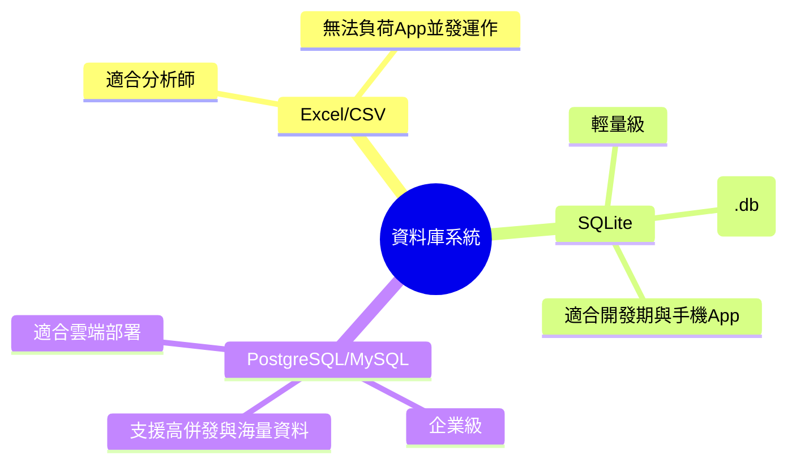

# 主題一：資料庫基礎與 SQLite

## 為什麼不用 Excel 或 CSV 就好？

做財金研究時，我們常常把資料存在 Excel 或 CSV 檔案裡面。這在做單次分析時很方便，但如果是要寫「應用程式 (App)」，就會遇到幾個致命的問題：

1. **不能多人同時修改**：如果兩個人同時打開 Excel 存檔，檔案很容易壞掉或起衝突。
2. **搜尋速度極慢**：當你的 CSV 有一百萬筆台股歷史交易紀錄時，要找到特定某一天的資料，程式要把整個檔案讀進記憶體，超級吃資源。
3. **資料正確性缺乏保障**：你可能會不小心在 Excel 的「股價」欄位輸入了文字 "N/A"，然後程式一讀取拿去算 NPV 就當機了。

**資料庫 (Database)** 就是為了解決這些問題而生的！它可以安全地讓多個請求同時存取、有超強的「索引」能力一秒找出你要的資料，還可以強制設定「這個欄位只能存小數點」，保護資料的純潔性。

## 什麼是 SQLite？

在真實產業界，大公司通常會用 PostgreSQL 或是 MySQL 這種大型資料庫（它們像是一整棟圖書館，需要專門蓋一棟建築物並請管理員來管）。

但我們現在還在開發初期！**SQLite** 就像是一個「隨身碟裡的行動圖書館」。
它**完全不需要安裝任何伺服器軟體**，只要你有寫 Python 程式，它就會自動在你的資料夾裡產生一個 `.db` 結尾的檔案，所有的資料就存在這個檔案裡。

完美適合我們這門課的開發步調，未來哪天我們的 App 爆紅了，把它換成 PostgreSQL 的成本也非常低！

## 關聯式資料庫的長相 (Tables)

在關聯式資料庫裡，資料都是以**資料表 (Table)** 的形式存放，你可以把它想像成一個非常嚴謹的 Excel 工作表。

| id (主鍵) | ticker (代號) | price (股價) | pe_ratio (本益比) |
| :--- | :--- | :--- | :--- |
| 1 | 2330.TW | 800.0 | 20.5 |
| 2 | AAPL | 170.5 | 25.1 |

- **Row (資料列)**：橫的，代表一筆完整的實體資料 (例如一檔特定的股票)。
- **Column (資料行/欄位)**：直的，代表這筆資料的某種屬性 (例如股價)。
- **Primary Key (主鍵)**：就是上面的 `id`。這就像是這筆資料的身分證字號，絕對不能重複！靠這個 id 我們就能精準抓到這筆資料。

