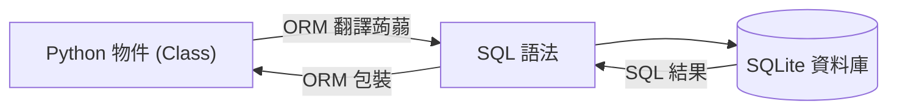

# 主題二：ORM 的魔法與 SQLModel

## 從前從前...手刻 SQL 的痛苦

資料庫有一套自己獨有的溝通語言，叫做 **SQL (Structured Query Language)**。
如果要從資料庫拿出台積電的資料，以前的工程師必須要在 Python 裡面這樣寫字串：

```python
# 傳統寫法 (不推薦)
cursor.execute("SELECT * FROM stocks WHERE ticker = '2330.TW'")
result = cursor.fetchone()
```

這有什麼問題？

1. **很冗長且容易打錯字**：萬一 `SELECT` 拼錯，或是引號少打一個，Python 根本檢查不出來，程式跑到那一行才會直接當機。
2. **缺乏物件導向思維**：拿出來的 `result` 是一坨原始資料，你沒辦法直接寫 `result.price` 來取得價格，可能只能用 `result[2]` 這種難以閱讀的方式取值。

## 救星降臨：ORM (Object-Relational Mapping)

ORM (物件關聯對應) 是一個「翻譯蒟蒻」！
它讓我們**完全不需要寫任何一行 SQL 語法**，只要用我們最熟悉的 Python 類別 (Class) 與物件操作，ORM 就會在背後自動幫我們翻譯成 SQL 語句去操作資料庫。



使用 ORM 後，我們寫程式會變成這樣優雅：

```python
# ORM 寫法 (優雅又安全)
stock = Stock(ticker="2330.TW", price=800.0, pe_ratio=20.5)
session.add(stock)  # 把這檔股票存進資料庫
session.commit()
```

## 關於 SQLModel

Python 界最老牌、強大的 ORM 叫做 **SQLAlchemy**，但因為它太老牌了，很多語法比較複雜。
近年來，FastAPI 的原作者開發了另一套神器叫做 **SQLModel**。

SQLModel 是站在巨人的肩膀上，它把 SQLAlchemy (最強資料庫操作) 跟 Pydantic (最強資料驗證，第一週我們提過) 結合在一起。
在 SQLModel 裡面，**一個 Class 既是定義資料驗證的規則，也是定義資料表 (Table) 的結構**。寫一次就搞定，對開發者非常友善！

### 讓我們看看長什麼樣子？

```python
from sqlmodel import SQLModel, Field
from typing import Optional

# 只要定義這個 Class，資料庫的 Table 就定義好了！
class Stock(SQLModel, table=True):
    # id 是主鍵 (primary_key=True)，讓資料庫自己編流水號，所以允許是空白 (Optional)
    id: Optional[int] = Field(default=None, primary_key=True)
    
    # 股票代號，必填，而且我們設定 index=True 可以讓搜尋這檔股票時變超快 (建立索引)
    ticker: str = Field(index=True)
    
    # 最近的股價，可以允許空值 (因為不一定每天都抓得到)
    price: Optional[float] = None
    
    # 本益比
    pe_ratio: Optional[float] = None
```

有了這種清楚的定義，Python 編輯器 (IDE) 還會提供極強的自動完成提示，打錯欄位名稱馬上就會有紅色底線警告，開發體驗滿分！
