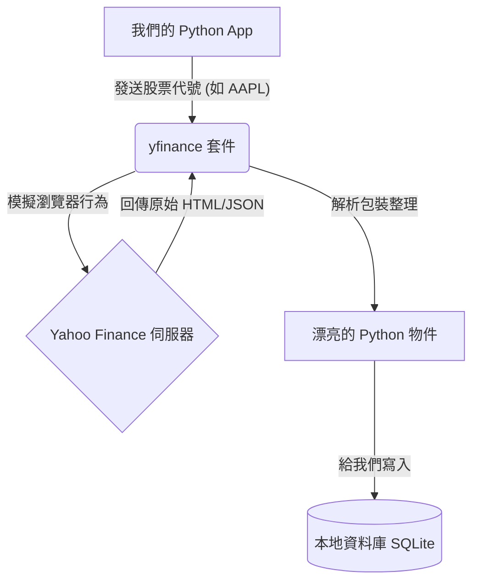

# 主題一：認識 yfinance 與金融數據源

## 巧婦難為無米之炊：我們需要數據

建好了超強的 App 架構和美美的資料庫，沒有真實的「數字」流進來，一切都是空談。在真實的量化交易公司裡，取得「穩定、乾淨、零延遲」的數據是要花大錢的（例如每年花幾十萬訂閱 Bloomberg 終端機或專屬 API）。

但對於我們開發個人的財經 App 或是做 Side Project 來說，我們需要的是**免費且容易上手**的解決方案。

## 為什麼選擇 yfinance？

`yfinance` 是一個在開源社群非常有名的 Python 套件。它並不是 Yahoo 官方出的，而是一群熱心的高手寫好的爬蟲程式，專門從 Yahoo Finance 網站上把資料「刮」下來，並包裝成我們非常好用的功能。

**優點：**

1. **完全免費**：不用註冊帳號，不用申請 API Key，裝了直接用。
2. **支援全球市場**：美股 (AAPL)、台股 (2330.TW)、甚至連加密貨幣 (BTC-USD) 都抓得到。
3. **資料種類多**：不僅有每日收盤價，連公司財報基本面（市值、本益比、ROE 等等）都有。

**缺點與限制：**

1. **穩定度不如付費 API**：如果 Yahoo 改版，套件可能暫時壞掉；或者如果你一秒鐘抓一萬次，你的 IP 會被 Yahoo 封鎖（這叫 Rate Limit）。
2. **延遲 (Delay)**：免費拿到的資料通常會有 15~20 分鐘的延遲，所以不能拿來做「高頻當沖交易」。但是對於我們的「長期價值投資分析儀」，延遲 15 分鐘根本沒差！

## 台股的代號小秘密

在 Yahoo Finance 裡面，每一個資產都有獨一無二的 "Ticker" (股票代號)。

- 美股就是原本的英文代號：蘋果是 `AAPL`，微軟是 `MSFT`。
- 台股上市 (TSE)：會在代號後面加上 `.TW`。例如台積電是 `2330.TW`。
- 台股上櫃 (OTC)：會在代號後面加上 `.TWO`。例如環球晶是 `6488.TWO`。

