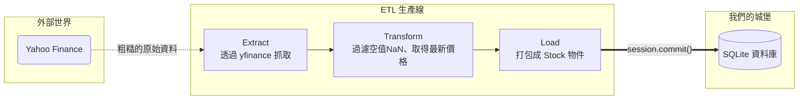

# 主題二：初探 ETL (資料工程的核心)

只要你和「資料」打交道，你一定會聽過 **ETL** 這三個英文字母。這是所有資料工程師 (Data Engineer) 每天都在做的事情。

ETL 分別代表：**Extract (萃取), Transform (轉換/清理), Load (載入)**。
把這套流程想像成「果汁工廠的生產線」，我們來看看每一步在做什麼：

## 第一步：Extract (萃取 🍎)

這是去果園採摘蘋果的過程。在我們的專案中，就是透過 `yfinance` 去網路把原始資料抓下來。
有時候抓下來的資料會包含很多我們不需要的東西，例如公司的地址、CEO 的名字，或是 1990 年的超古老股價。在這一階段，我們主要是「盡可能把需要的原物料收集齊全」。

## 第二步：Transform (轉換 🔪)

這是把蘋果洗乾淨、削皮、切塊的過程。這是 ETL 中**最重要也最花時間**的步驟！
從網路抓下來的資料通常很「髒」：

1. **格式不對**：Yahoo 給的可能是字串 `"800.5"`，但我們資料庫要的是浮點數 `800.5`。
2. **缺漏值 (Missing Values/NaN)**：如果某天颱風台股沒開盤，那天的價格就會是空值 (NaN)。如果我們直接拿 NaN 去算數學，程式就會直接當機！我們必須決定是要跳過這一天，還是把價格複製前一天的。
3. **衍生計算**：我們可能不只需要本益比，我們想要自己算「本益成長比 (PEG)」，那就在這一步把它算出來。

## 第三步：Load (載入 📦)

最後，把切好的蘋果裝罐密封起來。在我們的程式裡，就是利用上週學的 `SQLModel` 的 Session 機制，把乾淨的資料寫進我們的 SQLite `database.db` 中。

在這週的範例程式，我們會親手寫出我們人生第一條 ETL 生產線！
