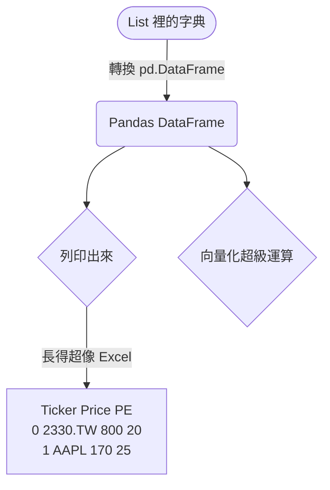

# 主題一：資料分析神兵 Pandas

## 把算盤換成大數據超級電腦

想像一下，如果我們有一萬筆股票的歷史資料存在一個 List 裡面。按照我們上學期學 Python 的邏輯，如果我們想把每一檔股票的股價都打九折，我們會寫一個 `for` 迴圈跑一萬次：

```python
# 傳統龜速算法
discounted_prices = []
for p in all_prices:
    discounted_prices.append(p * 0.9)
```

如果只是一萬筆還好，但如果是華爾街等級的每一毫秒交易數據呢？Python 的 `for` 迴圈天生速度就很慢，這時候我們就需要 **Pandas**！

Pandas 的底層是用一套非常靠近硬體的語言 (C 語言) 寫成的。當你叫它對全體資料打九折時，它是「瞬間」一起打折（這叫做**向量化運算 Vectorization**）。

## DataFrame (超跑版 Excel)

Pandas 最核心的東西叫做 **DataFrame**。
你可以把它想像成一個超級 Excel 工作表：

- 它有 Column Name (A欄、B欄... 在 Pandas 是欄位名稱)。
- 它有 Row Index (第1列、第2列... 在 Pandas 叫 Index)。



有了 DataFrame，我們要幫一萬筆股價打九折，程式碼會驚人地短：

```python
import pandas as pd

# 假設 df 是我們的 DataFrame，裡面有個欄位叫 Price
# 這行程式碼會瞬間把一萬個價格打九折，然後存成一個新欄位！
df['Discount_Price'] = df['Price'] * 0.9
```

## 常見的分析招式 (跟 Excel 類比)

在 Pandas 裡，幾乎所有你在 Excel 裡會做的事情都能用一行程式碼解決：

1. **新增計算欄位 (算市值)**：`df['MarketCap'] = df['Price'] * df['Shares']`
2. **篩選 (Filter)**：找出本益比小於 15 的股票 `df[df['PE'] < 15]`
3. **分組統計 (樞紐分析表)**：把股票依據產業類別分類算平均 `df.groupby('Industry').mean()`

學會 Pandas，你會覺得以前用 Excel 拉公式、如果不小心拉錯一格導致全錯的體驗簡直是原始人！
