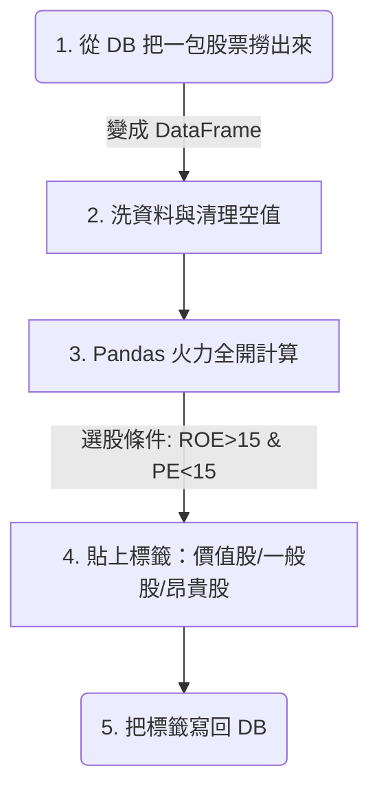

# 主題二：財務邏輯實戰 (三率與估值)

既然 Pandas 這麼強大，我們就直接把我們這門課的靈魂「選股邏輯」掛上去吧！
我們這個 App 叫做「護城河價值投資分析儀」，所以我們要找的不是隔天會漲停的飆股，而是**好公司遇到好價格**。

## 財務場景 1：好公司 (看獲利能力)

一般看公司的獲利能力，重點會放在三個比率 (三率)：
1. **毛利率 (Gross Margin)**：東西本身好不好賺？賣珍奶比賣便當毛利高。
2. **營業利益率 (Operating Margin)**：扣掉薪水、店面租金後，本業到底有沒有賺錢？
3. **淨利率 (Net Margin)**：扣掉稅金、業外投資收益後，最後能放到老闆口袋的有幾%？

在 Pandas 裡面，如果我們抓下來的資料有「營業收入(Rev)」、「毛利(Gross)」、「營業利益(Op)」跟「淨利(Net)」，我們就可以一口氣算出所有的比率：

```python
# 一次算完本週所有公司的三率！
df['毛利率'] = df['毛利'] / df['營業收入']
df['營益率'] = df['營業利益'] / df['營業收入']
df['淨利率'] = df['淨利'] / df['營業收入']
```
如果一間公司的這三個率長年都維持高檔，甚至比同業好很多，這就代表它擁有很強的「護城河」(也就是它有競爭優勢，別人打不過它，例如台積電)。我們可以用 `df[df['毛利率'] > 0.4]` 瞬間篩選出毛利 > 40% 的暴利公司。

## 財務場景 2：好價格 (看估值位階)

買好公司如果買太貴，也是會賠錢的。最經典的估價方式就是看 **本益比 (PE Ratio)**。
但是每一家公司的屬性不同，像是高科技股 (如 NVDA) 本益比 40 倍大家覺得很合理，但如果是傳產鋼鐵股，本益比 15 倍大家可能就覺得貴翻了。

所以我們要跟這檔股票「自己的過去」比。這叫做「本益比河流圖 / 估值位階」。

- **昂貴價**：如果現在的 PE 大於過去五年的平均 PE + 1個標準差。
- **合理價**：現在的 PE 在平均值附近。
- **便宜價**：現在的 PE 小於過去五年平均 - 1個標準差。

有了 Pandas，判斷這件事可以優雅到不行：
*(這個需要多根 K 線的歷史資料，我們在下一頁的 AI 教學會示範怎麼寫！)*


