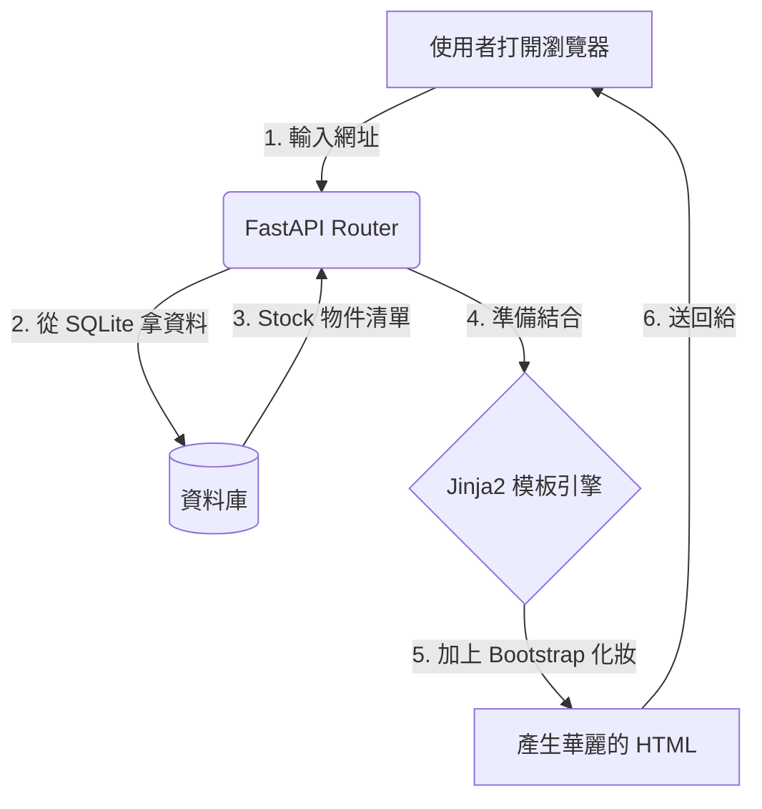

# Week 6: 課程內容 (Course Content)

## 學習目標

經過了五週的「黑畫面」訓練，我們的後端大腦已經非常聰明了。但如果要把我們寫的「護城河價值投資分析儀」給別人用，總不能叫他們去學怎麼執行 Python 吧？

這週的大事，就是我們要讓系統「長出臉來」！我們將學習如何讓 FastAPI 不只回傳冰冷的 JSON 數據，而是能回傳一個有排版、有顏色、有按鈕的漂亮網頁。

## 涵蓋主題

1. **Jinja2 模板引擎**
   - 什麼是 Server-Side Rendering (SSR)？
   - 如何把 Python 程式裡算好的 Pandas 變數，動態塞進 HTML 靜態網頁裡？
   - Jinja2 的基本語法：`{{ 變數 }}` 與 ``。

2. **Bootstrap 5 UI 框架**
   - 為什麼我們不自己手刻 CSS？
   - Bootstrap 的格線系統 (Grid System)：如何讓網頁在電腦與手機上看起來都正常響應？
   - 常用元件介紹：導航列 (Navbar)、卡片 (Cards)、表格 (Tables)。

3. **實作 Web 儀表板 (Dashboard)**
   - 將上一週算好的「好股票名單」，以優雅的 Bootstrap 表格呈現在網頁上。
   - 使用卡片顯示一些大盤的總覽數據。

## 本週預期產出

- 成功啟動包含 HTML 畫面的 FastAPI 伺服器。
- 寫出一個帶有精美導航列的網頁，網頁中央能動態顯示從我們 SQLite 資料庫倒出來的股票清單。

