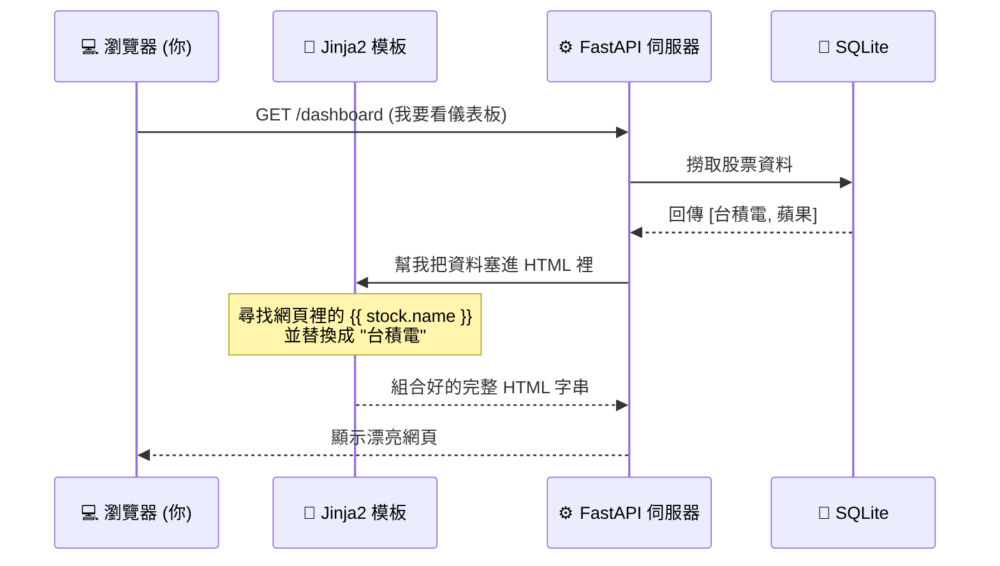

# 主題一：Jinja2 模板引擎與 SSR

## 靜態網頁 vs 動態網頁

如果我們只寫純 HTML，那麼所有來看這個網頁的人，看到的內容永遠都長得一模一樣（這叫**靜態網頁**）。
但在我們的系統裡，如果股價更新了，我們希望網頁重新整理後，看到的數字也會跟著改變。這就需要**動態網頁**技術。

我們採用的技術叫做 **SSR (Server-Side Rendering，伺服器端渲染)**。
這意思是說：在把網頁送到使用者的瀏覽器之前，伺服器（我們的 Python FastAPI）會先在背後「加工」這個網頁，把對的數字填進去，最後才送出完整的 HTML。



## Jinja2 的魔法標籤

要把 Python 的靈魂灌注到 HTML 的肉體裡，我們需要一個媒介，這就是 **Jinja2**。
它的語法非常簡單，只要在 HTML 檔案裡加上特殊的括號：

### 1. 印出變數：使用 `{{ }}`
如果在 Python 傳了一個變數 `title="台股價值分析儀"`，我們在 HTML 可以這樣寫：
```html
<h1>歡迎來到 {{ title }}</h1>
<!-- 渲染後會變成：<h1>歡迎來到 台股價值分析儀</h1> -->
```

### 2. 邏輯與迴圈：使用 ``
我們要印出一長串股票，當然不可能在 HTML 裡面把 `<tr>` (表格的列) 複製貼上一百次！我們可以在 HTML 裡面寫 For 迴圈：
```html
<tbody>
  <!-- 在 HTML 裡面寫 Python 迴圈是不是很酷！ -->
  
  <tr>
    <td>{{ stock.ticker }}</td>
    <td>{{ stock.price }}</td>
  </tr>
  
</tbody>
```

還能寫 If 判斷式，例如只有在 `roe > 0.15` 才顯示綠色字體：
```html

  <span style="color: green;">優質好股</span>

  <span>普通股</span>

```
