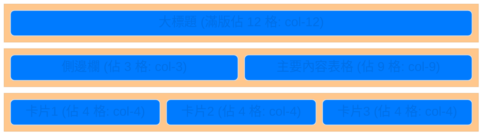

# 主題二：Bootstrap 5 快速美顏術

## 為什麼需要 Bootstrap？

純 HTML 畫出來的網頁就像一棟只有紅磚跟管線的毛胚屋，非常醜。如果你要讓它變漂亮，你就必須手寫一大堆 CSS 樣式代碼。

對於我們這種志在「金融後端與資料分析」的人來說，花好幾天去微調一顆按鈕的陰影跟圓角，投資報酬率實在太低了！所以，我們直接採用全世界最受歡迎的 UI 框架 —— **Bootstrap**。

引入 Bootstrap 後，我們只要在 HTML 的 `<class>` 屬性裡面打上指定的「咒語」（例如：這顆按鈕是紅色的危險按鈕 `btn btn-danger`），Bootstrap 就會自動套用它寫好的漂亮樣式。

## 核心概念：格線系統 (Grid System)

現代人看網頁，有時用 13 吋筆電，有時用 6 吋手機。網頁排版必須要像水一樣，能夠自動適應螢幕大小，這就叫「響應式設計 (RWD)」。

Bootstrap 把畫面的寬度切成了 **12 等分**。我們只要規定好每個區塊在不同裝置上要佔幾格：

## 必學的神奇咒語 (Classes)

只要背熟下面這幾個英文字，你的網頁瞬間就能升級好幾個檔次：

1. **表格 (`table`)**：
   原本醜醜的 HTML 表格，加上這幾個字就變漂亮了。
   `<table class="table table-striped table-hover">` (帶有斑馬紋路，而且滑鼠指過去還會發亮的表格！)

2. **卡片 (`card`)**：
   我們常用卡片來展示個股資訊。
   `
...
` (自帶極簡外框與淡淡的陰影)。

3. **顏色語意化 (Colors)**：
   Bootstrap 不用色碼，而是用「意義」來上色！
   - `text-success`：綠色字體 (代表上漲、成功)。
   - `text-danger`：紅色字體 (代表下跌、危險)。
   - `bg-primary`：藍色背景 (代表主要強調)。
