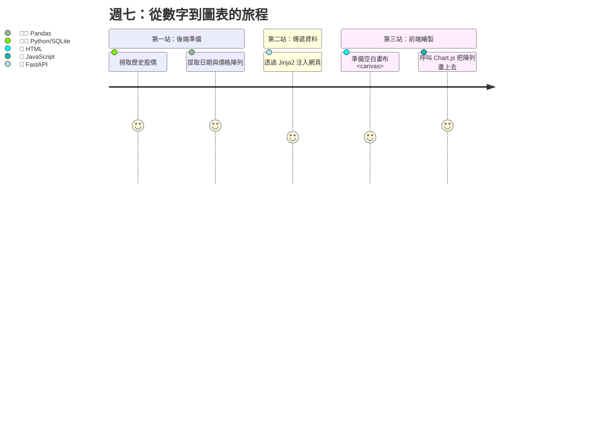

# Week 7: 課程內容 (Course Content)

## 學習目標

只有表格對大腦來說還是太吃力了，人類是視覺的動物！當我們有了一堆股票的歷史價格，如果沒把它畫成圖表，我們就很難看出趨勢。

這週我們要為我們的「護城河投資儀」加入豐富的視覺化效果。我們會介紹當今最紅的 JavaScript 繪圖庫：**Chart.js**，並學習如何把 Python 從資料庫撈出的數據，透過 Jinja2 傳進網頁畫布裡，畫成美美的互動式圖表。

## 涵蓋主題

1. **圖表的世界：為什麼選 Chart.js？**
   - 與 Python 內建的 Matplotlib 比較 (Matplotlib 是死圖，網頁上的圖要有互動性！)。
   - Chart.js 的核心架構：HTML 畫布 `<canvas>` 與 JavaScript 設定檔。
   - 常用圖表：折線圖 (Line Chart，看股價趨勢)、圓餅圖 (Pie Chart，看資產配置)。

2. **打通前後端的任督二脈**
   - 從 Python 清單轉換到 JavaScript 陣列。
   - 實作：將股票歷史 30 天的價格繪製成一張隨著滑鼠移動會顯示數值的動態折線圖。

3. **財務場景實戰**
   - 繪製雙軸折線圖：上面畫股價，下面畫成交量。
   - 視覺化展示「複利效應」或是「通膨侵蝕」的資產成長曲線。

## 本週預期產出

- 在我們上一週完成的 Dashboard 加上一個區塊，能成功跑出一張美觀的 Chart.js 趨勢圖。
- 圖表支援滑鼠互動 (Hover 時會跑出該點的詳細價格數字)。

