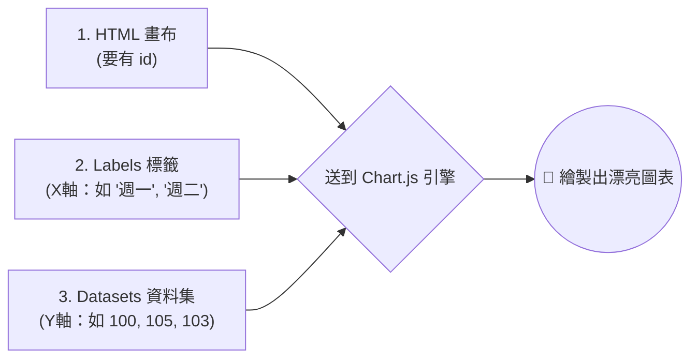

# 主題一：動態繪圖庫 Chart.js 介紹

## 原來網頁是這樣畫圖的！

如果你學過基礎 Python，可能用過 `matplotlib`。它畫出來的圖其實就是一張 `png` 圖片。如果你把它放在網頁上，滑鼠指過去它一點反應都沒有。

現代的網頁圖表都是用一種叫做 **`<canvas>`** (畫布) 的 HTML 元素，搭配 JavaScript (網頁專用的程式語言) 所畫出來的。這樣畫出來的圖表，不僅可以隨視窗大小改變比例，滑鼠移過去還會跳出提示框 (Tooltip)！

## 我們的選擇：Chart.js

在各種免費圖表套件 (Echarts, Highcharts, Plotly) 中，我們選擇用 **Chart.js** 帶大家入門。因為：
1. **非常簡單**：它的設定檔非常直覺，不像其他套件那麼深奧。
2. **美觀**：預設的顏色跟動畫效果就很舒服，適合財經 App。
3. **AI 擅長**：Chart.js 非常流行，所以 ChatGPT 生出來的 Chart.js 程式碼幾乎不會出錯。

## Chart.js 的三大核心元件

要把圖畫出來，我們必須準備三樣東西給 Chart.js：



### 1. 畫布 (Canvas)
在 HTML 裡面幫圖表留一個位置，並給它一個名字 (id)。
```html
<canvas id="myStockChart"></canvas>
```

### 2. 資料 (Data)
在 JavaScript 裡，定義兩條陣列 (Array)。一條控制 X 軸 (時間)，一條控制 Y 軸 (數字)。
```javascript
const my_labels = ['1/1', '1/2', '1/3']; // X 軸日期
const my_prices = [150, 155, 149];       // Y 軸股價
```

### 3. 設定與渲染 (Config)
告訴套件想要什麼形狀：「請幫我畫折線圖 (`type: 'line'`)，不要填滿藍色，線條要有一點平滑圓角 (`tension: 0.1`)」。
這部分我們會交給 AI 來寫！
