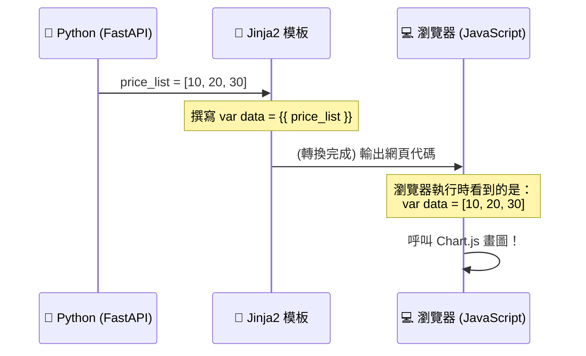

# 主題二：打通前後端 (Python 轉 JavaScript) 大作戰

這週是我們這個梯次第一次碰到 **JavaScript (JS)**！
JS 是網頁端唯一看得懂的語言。我們在後端用 Python 算得再辛苦，到了前端畫圖時，我們都必須把資料轉交給 JS。

很多初學者在這個地方會卡住：「Jinja2 (`{{ }}`) 是 Python 負責的，而 Chart.js 是 JS 負責的，它們到底要怎麼對話？」

## 運作原理揭密

請看下面這個精彩的情境：

1. **後端 (Python)**：
   我們在 FastAPI 裡抓了一檔股票最後 5 天的價格，並把它轉成一個 List 給 Jinja2。
   `price_list = [100, 101, 103, 102, 105]`

2. **渲染 (Jinja2)**：
   我們在 HTML 的 `<script>` 標籤中，透過 Jinja2 把變數塞進去。
   這時候請加上一個非常重要的魔法濾鏡：`tojson` 或 `safe`！

3. **前端 (JavaScript)**：
   等到瀏覽器下載這個網頁時，看在 JS 的眼裡，這已經變成一段合法的 JS 代碼了！



## 致命大坑：單引號的逆襲

Python 的 List 裡面如果是字串（如日期 `['2023-01-01', '2023-01-02']`），Jinja2 預設渲染出來的時候，有時候會把字元轉編碼（變成像 `&#39;` 這種怪字元），導致 JS 讀不懂而讓整個圖表當機消失不見。

### 正確解法 (Safe Filter)
我們一定要在 Jinja2 標籤後面補上 `| safe`。這等於告訴 Jinja2：「這包資料我自己保證很安全啦！你不要幫我亂改，原汁原味地印進大括號裡面！」

```javascript
// ✅ 在 HTML 檔案底部的 <script> 區塊中：
const chartLabels = {{ date_list | safe }};
```

過了這關，畫圖對你來說就跟喝水一樣簡單了！
