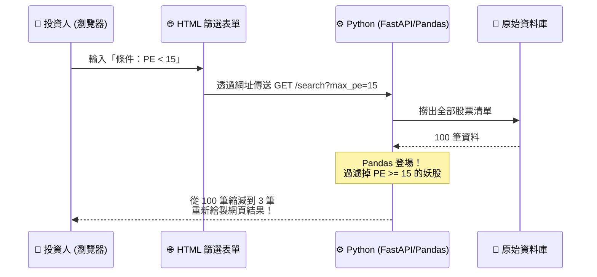

# Week 8: 課程內容 (Course Content)

## 學習目標

經過前面七週，我們的系統已經有資料、有運算大腦、有華麗的圖表跟排版了。
但是目前的網頁只能「單向」看資料，就像看報紙一樣。

真正的應用程式（App）需要具備「雙向互動」的能力。
這週我們要為系統掛上**「篩選器 (Screener) 介面與表單」**，讓使用者可以自己輸入「我只要看本益比小於 10，而且殖利率大於 5% 的公司」，我們的系統就會自動過濾並跑出專屬結果。

## 涵蓋主題

1. **HTML 表單 (Forms)**
   - 什麼是 `<form>` 和 `<input>`？
   - 搜集使用者輸入的常用元件：文字方塊 (Text)、數字範圍 (Number)、下拉式選單 (Select)。
   
2. **前後端的資料傳遞 (GET vs POST)**
   - 瀏覽器是如何把表單裡面的字，送到 Python 伺服器手裡的？
   - **GET 請求**：表單資料會像尾巴一樣黏在網址後方（例如 `?pe_max=10`），適合用來做搜尋跟篩選。
   - **POST 請求**：把資料藏在信封裡安全送出，適合用在密碼登入或結帳買股票。

3. **FastAPI 的參數接收**
   - 如何在 Python 端接住這些使用者傳過來的數字？
   - 結合 Pandas，根據使用者的篩選條件，動態改變我們傳給網頁的 DataFrame 結果。

## 本週預期產出

- 成功在網頁上方掛上一排「控制面板 (Control Panel)」。
- 當你在控制面板輸入「最高價格限制 50 元」並按下 [送出搜尋]，網頁會刷新，並且下方的股票清單會只剩下符合條件的便宜股票。

