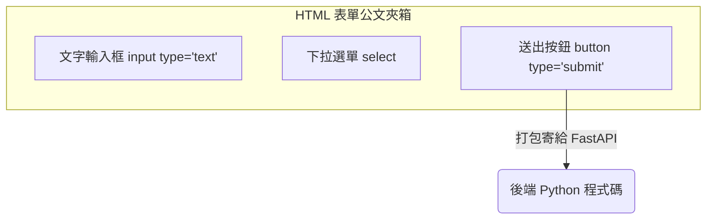

# 主題一：捕捉使用者意圖 (HTML 表單)

## 選股器的心臟：`<form>` 與 `<input>`

如果你想讓使用者輸入資料，你不能隨便在畫面上放幾個字框就好，你必須把它們放進一個叫做 `<form>` (表單) 的 HTML 標籤裡面。

你可以把表單想像成一個「公文夾箱」，而裡面的各種輸入框 (`<input>`, `<select>`) 就是需要使用者填寫的欄位。最後面放一個「送出按鈕」(`<button type="submit">`)，按下去的瞬間，瀏覽器就會把這個公文夾密封起來送給我們的 Python 伺服器。



## 必備的表單屬性 (非常重要！)

在寫表單時，最容易讓新手崩潰的就是忘記寫以下三個單字：`name`, `action`, `method`。

1. **`action` (寄送目的地)**：
   寫在 `<form>` 上，告訴瀏覽器這份表單要寄到哪個網址去。例如 `action="/search"`。
   
2. **`method` (寄送郵遞方式，預設是 GET)**：
   寫在 `<form>` 上。如果這只是個「查詢功能」，就用 `GET`；如果是包含個人機密的「轉帳功能」，就請用 `POST`。

3. **`name` (每個欄位的變數名稱)**：
   寫在每一個 `<input>` 裡面。**超級無敵重要**！如果你要讓使用者填寫「最高價格」，你卻沒有加上 `name="max_price"`，那送過去伺服器時，Python 根本不知道這欄數字到底代表什麼意思。

### 一包完整的表單範例 (搭配 Bootstrap 外觀)

```html
<!-- 告訴瀏覽器：用 GET 方式，把表單寄給伺服器的 /filter_stocks 網址 -->
<form action="/filter_stocks" method="GET" class="border p-3 mt-4">
    <div class="mb-3">
        <label>最高本益比限制：</label>
        
        <!-- 注意這個 name="max_pe"，FastAPI 靠它抓資料！ -->
        <input type="number" name="max_pe" class="form-control" placeholder="例如：15">
    </div>
    
    <button type="submit" class="btn btn-primary">開始篩選 🚀</button>
</form>
```
如果你在畫面上填了 `12` 然後按下按鈕，這時你的網址列會變形成：
`http://localhost:8000/filter_stocks?max_pe=12`
這就是 GET 請求的神奇！它把你的所有秘密都大方地寫在網址後面了！
