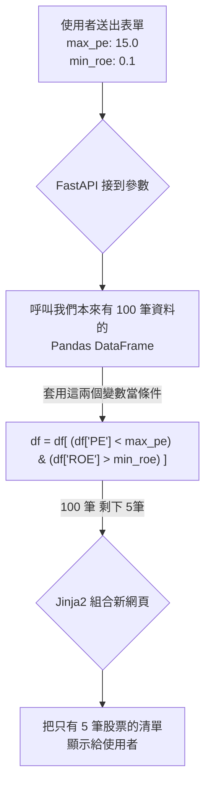

# 主題二：FastAPI 接球與 Pandas 過濾

## 後端接球：FastAPI

當瀏覽器把網址變成 `?max_pe=12` 送過來給我們的時候，我們身為防守員 (Python) 要怎麼接住這顆球呢？

在 FastAPI 裡面，接球簡單到不可思議。我們只要在 `@app.get` 綁定的函數中，設計一個同名參數就可以了！

```python
from fastapi import FastAPI
from typing import Optional

app = FastAPI()

# 我們對應到剛才 HTML 寫的 action="/filter_stocks"
@app.get("/filter_stocks")
async def do_filtering(max_pe: Optional[float] = None):
    # 這個 max_pe 就是從網址抓下來的 12.0
    # 因為使用者可能什麼都沒填就按送出，所以我們設定為 Optional 允許是空的 (None)
    
    if max_pe is None:
        return {"status": "請你填寫數字好嗎！"}
        
    return {"status": "成功", "您填寫的上限是": max_pe}
```

## 第二階段接力：呼叫 Pandas 除草

我們接到了使用者的 `max_pe` 數字，現在要把這個數字拿來篩選真正符合條件的股票清單，最後渲染 Jinja2 回去給使用者看！

這個時候，我們 Week 5 學過的 Pandas 向量運算就能發揮極大的威力：



這樣一來，我們就完整實現了「護城河價值投資分析儀」中最精華的「自訂過濾器 (Screener)」。
使用者可以隨心所欲地找出符合各種嚴苛條件的好股票，不用再一檔一檔自己拉 Excel 看花了眼。
