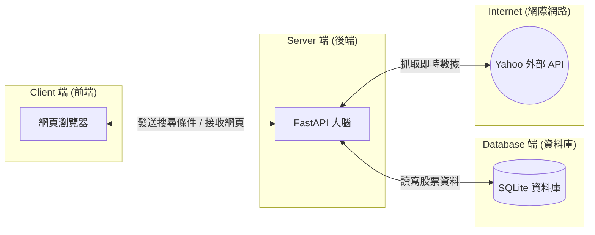

# 主題一：系統架構總複習 (Architecture Review)

在我們準備將 Web App 封裝完結之前，讓我們用上帝視角來看看我們親手打造的系統。這張圖也是各位未來在面試 FinTech 職缺時，用來解釋你專案架構的最好武器！

我們採用的是經典的 **三層式架構 (3-Tier Architecture)**：

### 1. 展現層 (Presentation Layer) - 我們的 Week 6, 7, 8
這就是使用者打開瀏覽器看到的東西。
- **負責工具**：HTML, CSS (Bootstrap 5), JavaScript (Chart.js), Jinja2。
- **工作職責**：只負責把畫面排漂亮，並把使用者的「點擊」和「表單輸入」包裝成網址 (URL) 傳給後端。它這層**沒有大腦**，不會自己算數學。

### 2. 應用邏輯層 (Application Logic Layer) - 我們的 Week 2, 4, 5
這是整個 FinApp 的大腦與指揮中心。
- **負責工具**：Python, FastAPI, Pandas, yfinance 套件。
- **工作職責**：
  - **接收掛號信**：FastAPI 接住從網頁傳來的條件 (例如 `max_pe`)。
  - **向外求援**：如果資料不夠新，叫爬蟲去 Yahoo 問。
  - **內部運算**：Pandas 負責把一萬筆資料按照選股邏輯瞬間過濾完。

### 3. 資料存取層 (Data Access Layer) - 我們的 Week 3
這是我們的記憶體金庫。
- **負責工具**：SQLite 檔案, SQLModel (ORM 翻譯蒟蒻)。
- **工作職責**：把大腦算好的標籤 (例如：超值、昂貴) 或是今天收盤價永久保存下來。如果系統關機重開，資料也不會消失。

> 💡 **未來展望：**
> 這套架構最強大的地方在於「解耦 (Decoupling)」。
> 下週開始進入 Mobile 階段時，我們只需要把「展現層」的 Browser 換成 iPhone/Android (Flutter 開發)，我們的邏輯層和資料庫**完全不需要重寫**，就能直接擁有一個手機版 App！
